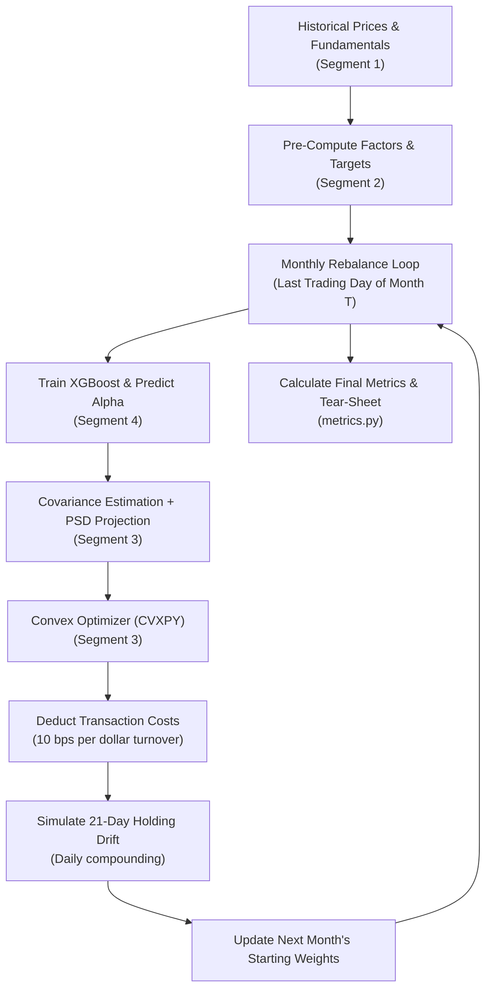

# Segment 5: Backtest Engine & Performance Metrics (Architecture & Interview Prep)

This document details the complete technical architecture, financial mathematics, and key interview defense questions for **Segment 5: Backtester & Metrics Engine** (`backtester.py` and `metrics.py`).

---

## 1. How Segment 5 Works (The Execution Lifecycle)

The Backtest Engine acts as a **Time-Machine Simulator** that links all previous segments into a continuous historical simulation loop from 2018 to the present.

### The 5 Phases Inside Each Rebalance Month:
1. **Phase 1 (Alpha Generation):** Calls `generate_ml_alpha()` which uses expanding-window XGBoost to rank stocks for the upcoming month.
2. **Phase 2 (Risk Covariance):** Takes trailing 252-day returns, calculates the Ledoit-Wolf shrunk covariance matrix, and projects it to Positive Semi-Definite (`make_closest_psd()`).
3. **Phase 3 (Optimization & Friction):** Passes alpha and covariance to `optimize_portfolio()`. Compares `target_weights` to `current_weights` to determine total two-way turnover, deducting **10 basis points (0.10%)** in transaction costs from the cash value.
4. **Phase 4 (Drift Simulation):** Calculates day-by-day compounding of portfolio value over the 21 trading days based on actual stock price changes. Recalculates drifted weights at month-end to serve as the baseline for next month's turnover constraint.
5. **Phase 5 (Performance Tear-Sheet):** Generates CAGR, Volatility, Sharpe Ratio, Max Drawdown, and Information Ratio against the Equal-Weighted benchmark.

---

## 2. Key Performance Metrics Explained (`metrics.py`)

| Metric | Mathematical Formula | Institutional Meaning |
| :--- | :--- | :--- |
| **CAGR (Annualized Return)** | $(1 + R_{\text{total}})^{\frac{252}{N}} - 1$ | The geometric average annual growth rate of the portfolio over the multi-year backtest. |
| **Annualized Volatility** | $\sigma_{\text{daily}} \times \sqrt{252}$ | The standard deviation of daily returns scaled to an annual basis. |
| **Sharpe Ratio** | $\frac{R_{\text{ann}} - R_f}{\sigma_{\text{ann}}}$ | Risk-adjusted return above the risk-free rate ($R_f = 2\%$). Measures return generated per unit of total risk. |
| **Maximum Drawdown** | $\min_t \left(\frac{V_t - \max_{\tau \le t} V_\tau}{\max_{\tau \le t} V_\tau}\right)$ | The largest peak-to-trough loss before a new peak is achieved (measures worst-case historical pain). |
| **Information Ratio (IR)** | $\frac{\text{Mean}(R_p - R_b) \times 252}{\text{Std}(R_p - R_b) \times \sqrt{252}}$ | Active Return divided by Tracking Error (Active Risk). Shows if the ML strategy consistently beats the benchmark. |

---

## 3. Key Design Decisions & Why We Made Them

### A. Pre-Computing Factors Outside the Loop
* **Decision:** We pre-compute all factor z-scores and forward returns across all dates *before* entering the monthly loop.
* **Rationale:** Recalculating rolling 252-day momentum and volatility inside the loop at each step takes minutes. Pre-computation reduces backtest runtime from ~10 minutes to under **15 seconds**.

### B. Modeling Weight "Drift"
* **Decision:** Weights are not held static during the 21-day holding period; they drift daily based on individual stock performance:
  $$w_{i, t} = \frac{w_{i, 0} \times \frac{P_{i, t}}{P_{i, 0}}}{\sum_j w_{j, 0} \times \frac{P_{j, t}}{P_{j, 0}}}$$
* **Rationale:** In the real world, winning stocks grow to represent a larger percentage of your portfolio. Ignoring drift distorts turnover calculation and underestimates real portfolio volatility.

### C. Explicit Transaction Cost Penalty (10 bps)
* **Decision:** For every rebalance, portfolio value is penalized: $\text{Cash} \times (1 - \text{Turnover} \times 0.0010)$.
* **Rationale:** Backtests without transaction costs are fantasy. A strategy that generates 15% return with 90% monthly turnover might actually lose money in real execution after commissions, exchange fees, and bid-ask slippage.

---

## 4. Important Interview Questions & Defenses

> [!IMPORTANT]
> **Interview Question:** *What is 'Portfolio Drift' and why is it a critical bug if a backtester ignores it?*
> 
> **Your Answer:** 
> "In institutional asset management, a portfolio is not rebalanced every single second. When you allocate 5% to Nvidia at the start of the month and it rallies 30% while the rest of the market is flat, Nvidia now makes up ~6.5% of your portfolio on day 21. 
> If a backtester assumes weights remain exactly 5.0% every day, it is implicitly assuming you are executing cost-free micro-rebalancing trades every single day. My backtester calculates exact daily price relatives and computes the drifted weights at month-end, ensuring that next month's turnover constraint starts from the true drifted portfolio state."

> [!WARNING]
> **Interview Question:** *Why did you benchmark against an Equal-Weighted universe (1/N) instead of the standard S&P 500 Market-Cap Weighted index (SPY)?*
> 
> **Your Answer:** 
> "Our investment universe consists of 98 mega-cap equities. In a cap-weighted S&P 500, the top 5-7 tech companies (Apple, Microsoft, Nvidia, Amazon, Alphabet, Meta) make up over 30% of the entire index weight. 
> Because our optimizer strictly caps individual stock weights at 5%, our portfolio can never hold a 30% concentration in 5 names. If tech rallies massively, a cap-weighted benchmark's performance is driven purely by mega-cap concentration, not factor alpha. Benchmarking against an Equal-Weighted universe isolates whether our Multi-Factor + ML strategy genuinely selected better stocks than a naive baseline, removing market-cap distortion."

> [!TIP]
> **Interview Question:** *If your backtest produces a Sharpe Ratio of 3.5 on equity factor data, would you deploy it to live trading?*
> 
> **Your Answer:** 
> "No, I would immediately suspect a bug. In equity factor investing, a genuine net Sharpe Ratio between **0.8 and 1.5** is realistic and excellent. A Sharpe Ratio > 3.0 on monthly equity factors almost always indicates **Look-Ahead Bias** (e.g., target forward returns leaking into features, unadjusted stock splits, or survivorship bias in the universe). I would audit the `.shift(-21)` target alignment, check that XGBoost only accesses past data, and verify transaction cost deductions."

> [!CAUTION]
> **Interview Question:** *How do you handle the initial 'burn-in' period in your backtest when the ML model doesn't have enough training data?*
> 
> **Your Answer:** 
> "Our dataset starts in Jan 2018, and our ML model requires at least 2 years (`ML_MIN_TRAIN_DAYS = 504`) of historical data before it can train effectively without overfitting. During 2018 and 2019, the backtest automatically activates the **Equal-Weighted Composite Z-Score Fallback** (averaging Value, Quality, Momentum, Low-Vol). Starting in Jan 2020, it seamlessly activates the XGBoost walk-forward model once the burn-in threshold is satisfied."
